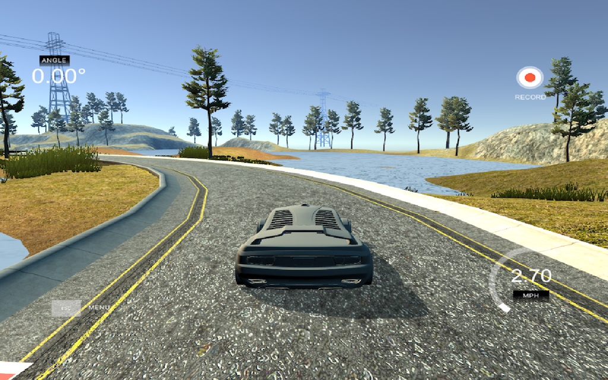
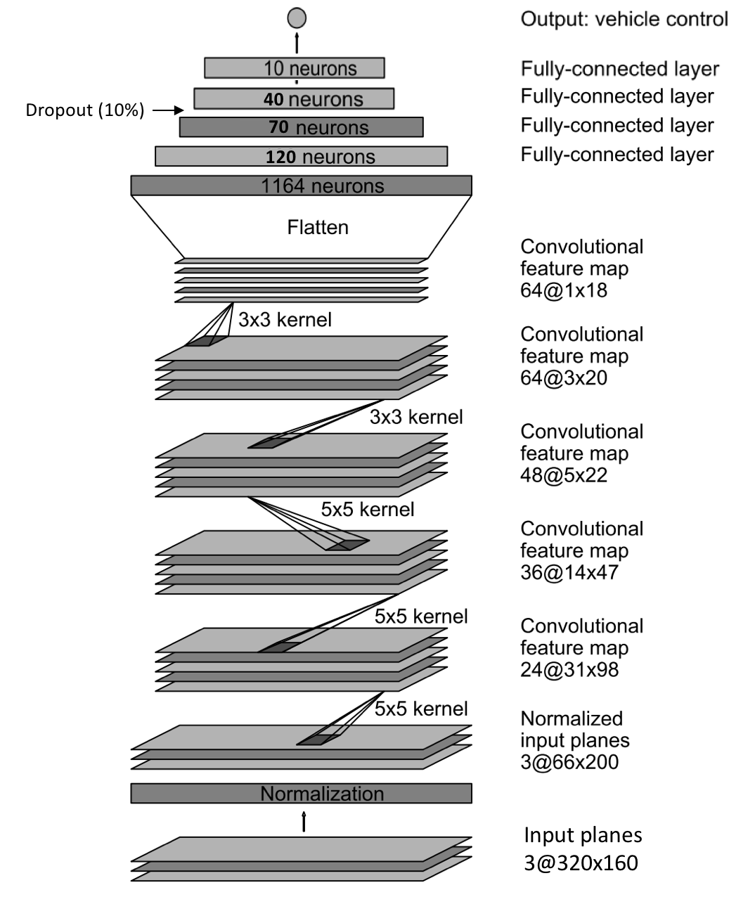

# **Behavioral Cloning** 



---

## Overview

This repository contains starting files for the Behavioral Cloning Project. It is part of the Udacity's [Self-Driving Car Engineer Nanodegree Program](https://www.udacity.com/course/self-driving-car-engineer-nanodegree--nd013). 


In this project, I have used what I have learned about deep neural networks and convolutional neural networks to clone driving behavior. 

I have trained, validated and tested a model usign Keras. This model outputs the steering angle to an autonomous vehicle.

For data collection, I have used a simulator to steer a car around a track. Image data and steering angles have been used to train a neural network. Finally, this model has been used to drive the car autonomously around the track.


## Goals/Steps

The goals / steps of this project are the following:
* Use the simulator to collect data of good driving behavior
* Build, a convolution neural network in Keras that predicts steering angles from images
* Train and validate the model with a training and validation set
* Test that the model successfully drives around track one without leaving the road
* Summarize the results with a written report
  
---
## Files Submitted & Code Quality

### 1. Submission includes all required files and can be used to run the simulator in autonomous mode

My project includes the following files:
* `model.py` containing the script to create and train the model
* `drive.py` for driving the car in autonomous mode
* `model.h5` containing a trained convolution neural network 
* `writeup_report.md` and `writeup_report.pdf` summarizing the results

### 2. Submission includes functional code
Using the Udacity provided [simulator](https://github.com/udacity/self-driving-car-sim) and my `drive.py` file, the car can be driven autonomously around the track by executing :

```sh
python drive.py model.h5
```

### 3. Submission code is usable and readable

The `model.py` file contains the code for training and saving the convolution neural network. The file shows the pipeline I used for training and validating the model, and it contains comments to explain how the code works.

## Model Architecture and Training Strategy

My final model is based on this [nVIDIA's](http://images.nvidia.com/content/tegra/automotive/images/2016/solutions/pdf/end-to-end-dl-using-px.pdf) architecture:

Nevertheless, I have modified it to:
   - Normalize the image.
   - Crop the image on the top and the bottom.
   - Add [dropout](https://www.cs.toronto.edu/~hinton/absps/JMLRdropout.pdf) to reduce/prevent overfitting.
   - Change the number of nodes of the fully connected layers.

Here is a visualization of the architecture (`clone.py` lines 70-85):



#### 2. Attempts to reduce overfitting in the model

The model contains a dropout layer in order to reduce overfitting (clone.py line 82). In addition two that, I have only used 2 epochs to train the network. When training the network, I noticed that the network started overfitting when trained with 3 or more epochs. 

The model was trained and validated on different data sets to ensure that the model was not overfitting. The model was tested by running it through the simulator and ensuring that the vehicle could stay on the track.


#### 3. Model parameter tuning

The model used an adam optimizer, so the learning rate was not tuned manually (clone.py line 181).

#### 4. Appropriate training data

The original training test set has been augmented by flipping the images horizontally and taking the opposite sign of the steering measurement.

Track one has a left turn bias. I have recorded counter-clockwise laps around the track to combat the bias. It also gives the model a new track to learn from, so the model will generalize better.

The network also crops the top and the bottom of the images, discarding the images landscape and the car's hood.

Finally, the images captured from the left and right sides of the car have been used, but the steering angles have been corrected. During the training, I noticed that the car tended to one side more than the other. I have applied different values to correct that behaviour (clone.py lines 51-54).
